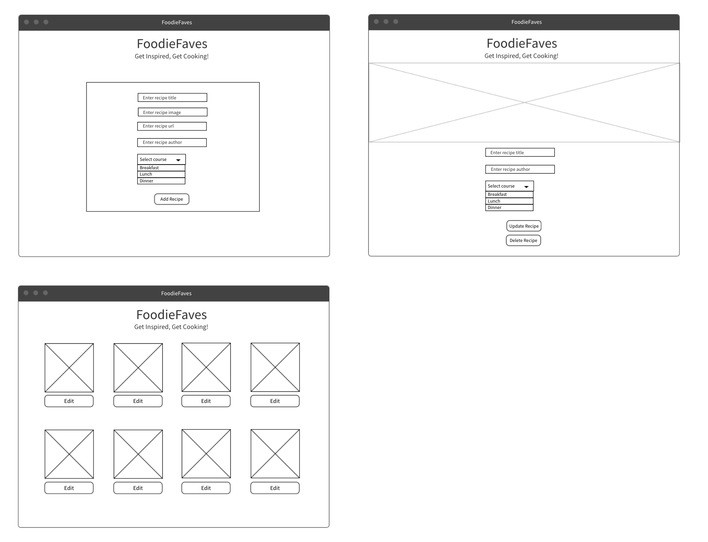

# PROJECT NAME: FoodieFaves

### Description: 
FoodieFaves is an app that lets you create lists of your favorite dishes you've tried and dishes you want to make. 

### Links:
- [**Link to Frontend Github**](https://github.com/mrunaleepatel/Project4-FoodieFavesFront)
- [**Link to Backend Github**](https://github.com/mrunaleepatel/Project4-FoodieFaves)
- [**Link to Deployed Site**](https://aquamarine-capybara-9fc630.netlify.app/)

### Technologies used by this app:
* HTML
* CSS 
* Node
* React
* Python
* Django
* Postman

### Mockup: 

### Screenshots of deployed site:

